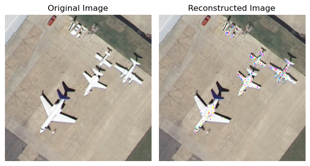
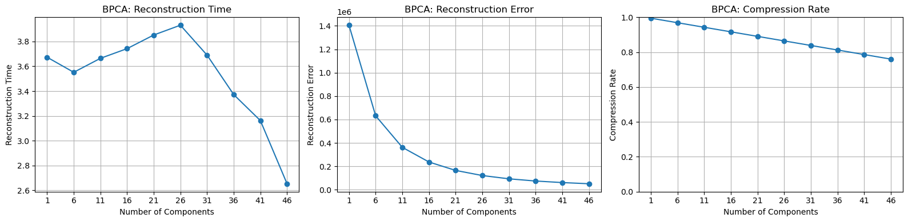
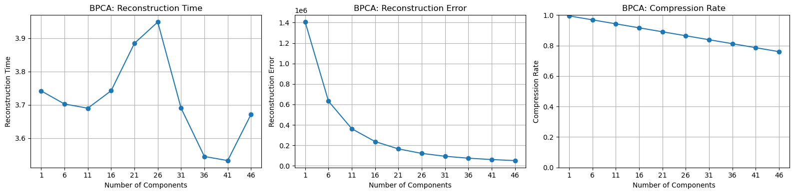
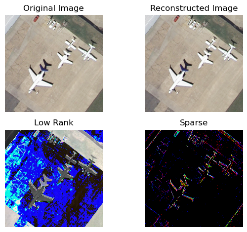
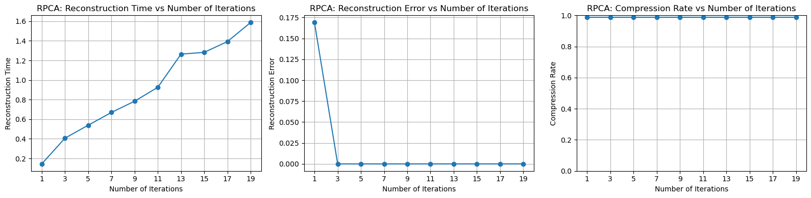
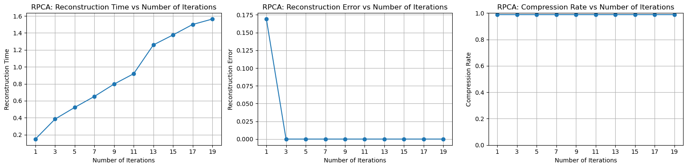

# 《数据科学与工程算法》项目报告

报告题目：基于Robust PCA对于基础PCA算法的改进实现和测试

姓名：沈桐乐

学号：10215501403

完成日期：2023年6月8号

## 摘要

对于图片数据集来说，使用SVD分解的PCA方法是一种传统的有损图像压缩算法，但是这种算法难以处理图像有明显成分和尖锐噪点的问题，因此引入了鲁棒PCA的算法，对于给定的数据集，在相同的计算时间当中取得了高压缩率和极低的重构误差，以及极快的收敛速度，取得了非常好的改进成果

## 项目概述

基于特征值的压缩算法在很多领域都是非常重要的，因为特征值本身具有很强的代表性，基于这个概念研究者提出了非常多的压缩方法，其中最经典的莫过于基于SVD分解的PCA方法，通过计算最大特征值，选择主成分来重构原数据集，在课上我们学习了数学证明和算法的基本形式

我们研究的数据集是一张像素图，项目主要通过经典的PCA方法和改进的Robust PCA方法来有损重构图像，目标取得的是最大的压缩率，最小的压缩率和压缩时间

## 问题定义

本次我们需要压缩的数据是图片集，因此输入的是一个二维点阵$G$，每一个点包含三个参数，分别表示RGB三个色度，$G \in \mathbb{R}^{m\times n \times 3}$

我们需要对图片的信息进行**有损压缩**，评判的标准一共有三个：重构误差，压缩时间和压缩率

我们的目标是最小化重构误差和压缩时间，最大化压缩率，这就需要相关的数学方法来做支持

## 方法

对于输入矩阵来说，因为其一个点包含三个元素，所以我把这个向量矩阵“展开”成了二维，也就是让三个点平铺到行向量上面，因此，输入的矩阵变成了二维实数空间$\mathbb{R}^{(m\times 3)\times n}$，之后就可以对矩阵的成分进行分析

### Basic PCA

最基本的方法就是按照课本上描述的，一共分为以下几个步骤

- 计算中心化向量 $\overline{\mathbf{x}}=\frac{1}{n} \sum_{i=1} \mathbf{x}_i$ 并去中心化 $\mathbf{y}_i=\mathbf{x}_i-\overline{\mathbf{x}}$
- 构造 $d \times n$ 维矩阵 $Y=\left[\mathbf{y}_1, \mathbf{y}_2, \ldots, \mathbf{y}_n\right]$, 计算 $d \times d$ 维协方 差矩阵 $C=\frac{Y Y^{\top}}{n-1}$
- 对 $C$ 矩阵进行正交对角化 (对 $Y$ 矩阵进行 SVD 分 解) , 假定 $\lambda_i$ 对应的特征向量为 $\mathbf{u}_i$
- 保留前 $k$ 个大于 $\alpha$ 的特征值对应的特征向量
- 降维重建向量 $\widehat{\mathbf{x}}_i=\left[\mathbf{u}_1, \ldots, \mathbf{u}_k\right]^{\top} \mathbf{x}_i$

对于这个算法来说，具体的实现思想是认为输入图片具有一定的特征，比如数据集1，农田图片的特征就非常明显，**最大特征值**对应的**特征向量**能够最好地重构原图，认为这样可以在固定压缩率的情况下最小化重构误差

这个方法的参数只有一个，就是**选择主特征值的个数**

以下是代码实现部分：

第一步：加载图片并且展开称为二维的矩阵

```py
class BasicPCAEngine:
    def __init__(self, img_path):
        self.img_path = img_path
    
    # @timeit
    def load_img(self):
        self.image = imageio.imread(self.img_path)
        # Convert the image matrix to a 2D matrix
        self.image_2d = self.image.reshape(self.image.shape[0]*self.image.shape[2], 	self.image.shape[1])
```

第二步，通过上面的步骤获得协方差矩阵，计算出特征值

在这一步当中，最主要的部分是计算多个特征值的部分，在basic pca当中，我的实现是使用了最基础的**幂法**，每计算出一轮特征值$\lambda_i$和特征向量$x_i$，就把原先的协方差矩阵减去特征向量的外积，和特征值的数乘
$$
C_{i+1}=C_i-\lambda_i(x_ix_i^T)
$$
这样之后就可以计算出下一次第$i+1$大的特征值$\lambda_{i+1}$

```py
@timeit
def pca(self):
    # Step 1: Calculate the decentralized matrix Y
    self.mean_vector = np.mean(self.image_2d, axis=0)
    self.decentralized_matrix = self.image_2d - self.mean_vector

    # Step 2: Calculate the covariance matrix C
    covariance_matrix = np.cov(self.decentralized_matrix.T)

    # Step 3: Calculate the eigenvalues and eigenvectors of the covariance matrix
    eigenvalues = []
    eigenvectors = []

    for i in range(covariance_matrix.shape[0]):
        eigenvalue, eigenvector = self.basic_eigen(covariance_matrix)
        eigenvalues.append(eigenvalue)
        eigenvectors.append(eigenvector)

        # Deflate the covariance matrix
        covariance_matrix -= eigenvalue * np.outer(eigenvector, eigenvector)

    # eigenvalues, eigenvectors = np.linalg.eig(covariance_matrix)

    eigenvalues = np.array(eigenvalues)
    eigenvectors = np.array(eigenvectors)

    self.eigenvalues = eigenvalues
    # self.eigenvectors = eigenvectors
    self.eigenvectors = eigenvectors.T
```

对于这个幂法的改进会在之后一起讨论，首先我们关注实现整个算法的本身。以下是使用基础幂法计算一次特征值和特征向量的函数，这个算法的实现原理在书上和作业当中都有出现，这里就不再赘述

```py
def basic_eigen(self, mat, num_iterations=1000, tol=1e-6):
    # Initialize a random vector
    v = np.random.rand(mat.shape[0])

    for _ in range(num_iterations):
        # Perform matrix-vector multiplication
        v_new = np.dot(mat, v)

        # Normalize the vector
        v_new /= np.linalg.norm(v_new)

        # Calculate the eigenvalue estimate
        eigenvalue = np.dot(v_new.T, np.dot(mat, v_new))

        # Check for convergence
        if np.abs(eigenvalue - np.dot(v.T, np.dot(mat, v))) < tol:
            break

        # Update the vector
        v = v_new

    # Calculate the eigenvector
    eigenvector = v

    return eigenvalue, eigenvector
```

第三步：选择主特征值的个数重构矩阵

对选择的特征值个数，对与对应的特征值向量和特征向量组阶段，通过和原先的去中心化矩阵做内积，最后加上均值，最后需要注意的是需要把二维矩阵组装成高维矩阵，这样我们就完成了重构的操作

```py
@timeit
def reconstruct(self, num_components):
    # Step 4: Select the significant eigenvectors and eigenvalues
    self.selected_eigenvectors = self.eigenvectors[:, :num_components]
    self.selected_eigenvalues = self.eigenvalues[:num_components]

    # Step 5: Reconstruct the vector for each principal component
    self.reconstructed_vectors = np.dot(self.decentralized_matrix, self.selected_eigenvectors)

    # Step 6: Reconstruct the matrix
    self.reconstructed_image_2d = np.dot(self.reconstructed_vectors, self.selected_eigenvectors.T) + self.mean_vector
    self.reconstructed_image = self.reconstructed_image_2d.reshape(self.image.shape)
```

### 测试效果和改进方法的讨论

以上我们完成了最基础版本的PCA，可以关注到的是，在分别对计算特征值和重构的装饰器结果来看，计算特征值的函数占用了绝大多数的时间，因为涉及到不断的向量和矩阵乘法，而重构的部分是有限次的矩阵乘法，时间消耗可以忽略不计

压缩率计算的原理是：可以看到算法当中重构需要的元素大小总和分别是

- 本身的去中心化矩阵切片
- 特征向量组切片
- 特征值个数

把这些加起来除以整个图片的大小即可得到整个算法的压缩率

```py
def compress_rate(self):
        component_sizes = self.selected_eigenvectors.size + self.selected_eigenvalues.size + self.reconstructed_vectors.size
    
        # Calculate the compression rate
        rate = component_sizes / self.image.size
        return 1 - rate
```

对于重构误差，对比的是原先图片的二维展开形式，和重构图片的二维形式的差值平方，这个和书上的定义是类似的，当然也可以使用均方误差（MSE）来度量，只需再除以像素点的总数即可

```py
def reconstruct_err(self):
    return np.linalg.norm((self.image_2d - self.reconstructed_image_2d)**2)
```

对于压缩率和重构误差的效果方面，首先来看一张重构的对比图（主成分个数为100/256）

重构误差：12871.70203473341 

压缩率：0.47865804036458337

\

从重构的图当中可以明显地看出一个问题：飞机作为整个图片当中非常突出的元素，其身上的白色和整个地面的颜色相差非常大，对于基础pca的方法假设来说，这个图很难用简单的特征值和特征向量来表达，因此可以观察重构的结果当中，机身的白色身上出现了非常不和谐的**单色点**，然而，主成分选择的数量已经非常高，在测试当中哪怕使用更多的主成分也无法很好地避免这个问题（这里压缩率已经很低了，仅仅是47.87%），因此，对于基础的PCA假设来说，我们需要引入额外的方法来处理这种情况，这个假设过于简单了

---

在时间测试的部分，因为计算特征值的部分消耗了很多时间，因此第二个改进方向是**选择更快的特征值计算方法**，像是`numpy`，`scipy`也提供了相应的函数来加速计算（在代码当中先用了这些方法，之后用自己写的版本代替），比如使用基于QR方法计算出海森堡矩阵，再计算特征值，能在数学上获得更低的复杂度。但是本次实验没有选择在这个方面优化，因为现有的库已经优化的非常好了，实际上用的时候还涉及到底层的语言和指令集的优化，这一部分自己再怎么写也不可能超过现有的库。

---

**对于三个数据集的测试结果**

测试的主成分个数是`range(1, 51, 5)`






重构的时间是比较稳定的，压缩率也和选择的主成分是线性关系，但是对于重构误差的下降速率一直在降低，原因我认为就是没有办法处理这些噪点的问题。

综上，实验的解决目标是飞机上的噪点，同时保证很高的压缩率和相对不多的计算时间。对于这一部分，研究者提出了一种非常好的解决方法：鲁棒PCA方法

### Robust PCA

我理解的这个算法的主要思想是这样的：

研究者认为需要重构的图像可以被分解成以下两个部分的和：

- 低秩矩阵
- 稀疏矩阵：尖锐的噪声矩阵

整个问题可以被理解成为一个优化问题：最小化低秩矩阵的rank，和尖锐噪点的个数的总和

但是rank函数本身不是一个凸函数，所以使用**核范数**（奇异值的L1范数）取而代之，这样原问题就可以被表述为一个凸优化问题
$$
\begin{array}{ll}
\operatorname{minimize} & \|L\|_*+\lambda\|S\|_1 \\
\text { subject to } & L+S=M
\end{array}
$$
这样我们就获得一个线性约束图优化问题，可以调用求解器直接解出结果，但是对核范数和稀疏矩阵优化的收敛速度非常慢，核范数需要通过**缩小法**（shrinking）来计算奇异值，复杂度和SVD分解是差不多的，论文当中给出了一种**增广拉格朗日乘子法（ALM）**，对于RPCA进行优化迭代，引入了缩小乘子和截断SVD分解来加速优化，原论文的部分如下：

>The ALM method operates on the augmented Lagrangian
>$$
>l(L, S, Y)=\|L\|_*+\lambda\|S\|_1+\langle Y, M-L-S\rangle+\frac{\mu}{2}\|M-L-S\|_F^2 .
>$$
>A generic Lagrange multiplier algorithm [5] would solve PCP by repeatedly setting $\left(L_k, S_k\right)=$ $\arg \min _{L, S} l\left(L, S, Y_k\right)$, and then updating the Lagrange multiplier matrix via $Y_{k+1}=Y_k+\mu(M-$ $\left.L_k-S_k\right)$.
>
>For our low-rank and sparse decomposition problem, we can avoid having to solve a sequence of convex programs by recognizing that $\min _L l(L, S, Y)$ and $\min _S l(L, S, Y)$ both have very simple and efficient solutions. Let $\mathcal{S}_\tau: \mathbb{R} \rightarrow \mathbb{R}$ denote the shrinkage operator $\mathcal{S}_\tau[x]=\operatorname{sgn}(x) \max (|x|-\tau, 0)$, and extend it to matrices by applying it to each element. It is easy to show that
>$$
>\arg \min _S l(L, S, Y)=\mathcal{S}_{\lambda \mu}\left(M-L+\mu^{-1} Y\right) .
>$$
>Similarly, for matrices $X$, let $\mathcal{D}_\tau(X)$ denote the singular value thresholding operator given by $\mathcal{D}_\tau(X)=U \mathcal{S}_\tau(\Sigma) V^*$, where $X=U \Sigma V^*$ is any singular value decomposition. It is not difficult to show that
>$$
>\arg \min _L l(L, S, Y)=\mathcal{D}_\mu\left(M-S-\mu^{-1} Y\right)
>$$
>Thus, a more practical strategy is to first minimize $l$ with respect to $L$ (fixing $S$ ), then minimize $l$ with respect to $S$ (fixing $L$ ), and then finally update the Lagrange multiplier matrix $Y$ based on the residual $M-L-S$, a strategy that is summarized as Algorithm 1 below.

以下是算法部分：


这个算法需要计算截断SVD分解，但是上面已经给出了特征值的计算，所以这里就不再列出

```py
class RPCAEngine:
  @timeit
  def reconstruct(self, num_iter = 100):
      rpca = R_pca(self.image_centered)
      L, S = rpca.fit(max_iter=num_iter, iter_print=10)
      self.reconstructed_image = L + self.mean_vector + S

      self.reconstructed_image = 			self.reconstructed_image.reshape(self.image.shape)
      self.L = L.reshape(self.image.shape)
      self.S = S.reshape(self.image.shape)
```

```py
class R_pca:
		# ...
    @staticmethod
    def shrink(M, tau):
        return np.sign(M) * np.maximum((np.abs(M) - tau), np.zeros(M.shape))
      
    def svd_threshold(self, M, tau):
        U, S, V = self.mysvd(M, full_matrices=False)
        return np.dot(U, np.dot(np.diag(self.shrink(S, tau)), V))

    def fit(self, tol=None, max_iter=1000, iter_print=100):
        iter = 0
        err = np.Inf
        Sk = self.S
        Yk = self.Y
        Lk = np.zeros(self.D.shape)

        if tol:
            _tol = tol
        else:
            _tol = 1E-7 * self.frobenius_norm(self.D)

        while (err > _tol) and iter < max_iter:
            Lk = self.svd_threshold(self.D - Sk + self.mu_inv * Yk, self.mu_inv)
            Sk = self.shrink(self.D - Lk + (self.mu_inv * Yk), self.mu_inv * self.lmbda)
            Yk = Yk + self.mu * (self.D - Lk - Sk)
            err = self.frobenius_norm(self.D - Lk - Sk)
            iter += 1
            if (iter % iter_print) == 0 or iter == 1 or iter > max_iter or err <= _tol:
                print('iteration: {0}, error: {1}'.format(iter, err))

        self.L = Lk
        self.S = Sk
        # print("RPCA Iter: ", iter)
        return Lk, Sk
```

实现的和上述算法描述的是一致的，算法有一个超参数$\mu=1e-7$，调整几次时候发现这个数量级是最好的，有一个参数：**迭代次数**，也就是限制迭代次数的上限，除非算法已经收敛

#### 测试效果

运行测试用例可以发现这个算法的效果非常优秀，为了展示分解的效果，我把分解完的低秩矩阵L和稀疏矩阵S也进行了可视化，以下是50次迭代上限，调整到和上面Basic PCA使用相同时间到重构结果

重构误差：1.153317020970679e-06

低秩矩阵的秩：3



可以看到这个方法非常有效地消除了BPCA的尖锐噪声的问题，同时达到了非常非常高的压缩率（仅仅3，一共有256行）

我们再来看一下和上面一样的测试，测试的迭代次数为`range(1,21,2)`，由于效果过于优秀，甚至没有办法把两个图放在一起比较

当然这里的重构误差计算和之前是一样的，对于压缩率来说，这里是低秩矩阵的秩/行数加上尖锐噪点的个数（这个非常少，甚至可以忽略）






对于这三个仅仅256行的数据集来说，**仅仅一到两次迭代**就让重构误差降低到无法图示，当然时间上随迭代次数线性增长，压缩率由于这些数据集的低秩优化后，rank<=4,压缩率也非常高，所以结论就是，RPCA在时间和空间上都对Basic PCA的改进非常巨大

## 结论

本次实验实现了Basic PCA和Robust PCA的改进方法，获得了很不错的结果，不过还是有以下几个方面需要改进：

- 测试数据集

数据集可以测试更大的图片，也可以测试清晰度和噪点不同的图片，这样可以更好地评估RPCA的性能

- 优化算法的数学证明

由于论文的数学要求比较高，作为实现来说没有时间手推一下整个RPCA的ALM算法的数学过程，如果算一遍的话会有更好的理解（当然，难度确实太大了）

- 优化算法本身的数学问题

这个算法和经典的拉格朗日乘子优化法是有些不一样的，这个算法的两个算子M和Y不是互相独立的，对于松弛上来说这个算法的难度非常大。论文的最后作者也提出了可能的改进的层面，就是认为原先的图片$M$不仅分为一个低秩矩阵$L$，一个稀疏矩阵$S$，再引入一个**稠密的扰动矩阵**$N$，这个稠密矩阵是为了分离出稠密噪声（和稀疏噪声不同），这个思想也是非常可行的，在更大的数据规模下能够进一步地降低低秩矩阵的秩，以及提升稀疏噪点的有效性，优化函数可以变成下面的形式
$$
M=\mathcal{A}\left(L_0\right)+\mathcal{B}\left(S_0\right)+\mathcal{C}\left(N_0\right)
$$
甚至可以把RPCA和传统PCA，或者其他的PCA结合起来

- 优化算法的实现问题

这对于每个算法都是老生常谈的，使用更快的语言和计算资源，系统等等，论文也提到了这个方法同样可以处理视频/音频流数据，化学生物等科学计算数据，应用范围非常广泛

## 参考文献

Candès, E. J., Li, X., Ma, Y., & Wright, J. (n.d.). Robust principal component analysis? Microsoft Research Asia 2009 Retrieved from https://statweb.stanford.edu/~candes/papers/RobustPCA.pdf

